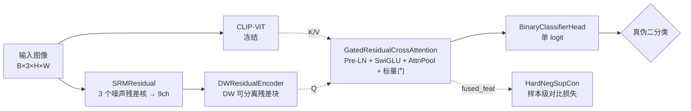

> 在 **Forensics Adapter (CVPR'25)** 与 **DeepfakeBench (NeurIPS'23)** 基础上的重构版本。
> **核心思想保持不变**：冻结的 CLIP 主干 + 高频残差辅助通道 + 残差引导的交叉注意力融合 + 对比辅助损失。
> 但**模块拆分、具体方法和执行顺序全部重新设计**。

---

## 🧭 Pipeline



执行顺序总览：`SRM → DW 编码 → Q=残差 / K,V=CLIP 的门控交叉注意力 → BCE+LS 主损失 + Hard-Neg SupCon 辅助损失 → AMP + Cosine warmup + EMA → 跨域 AUC 选最佳 ckpt`。

---

## ✨ 与上一版的差异速览

| 维度 | 上一版 | DRF v2 |
|---|---|---|
| 高频滤波 | 单个 Laplacian (3ch) | **SRM 3 个噪声残差核 (9ch)** |
| 残差编码器 | 朴素 Conv→ReLU→AvgPool | **MobileNet 风格 DW 可分离残差块** |
| 融合层 | `nn.MultiheadAttention` + Post-LN + mean-pool | **手写 SDP-Attention + Pre-LN + SwiGLU + 可学习 [CLS] AttnPool + 标量门控** |
| 分类头 | 2-class CE | **单 logit + BCEWithLogits + label smoothing** |
| 对比损失 | 全负例 SupCon | **Hard-Negative SupCon (top-k 难负例)** |
| 优化器 | Adam + StepLR (per-epoch) | **AdamW + Cosine warmup (per-step)** |
| 训练循环 | naive fwd/bwd | **AMP + GradScaler + 梯度累积 + EMA, eval 用 EMA 模型** |
| 数据增强 | albumentations 固定 7 项 | spatial→photo→noise→jpeg→**Cutout**→norm，可调 `augment_strength` |
| 指标 | 函数 `compute_metrics` | **`MetricMeter` 类**：AUC/AP/EER/ACC/Best-F1 |
| 目录 | `training/ data_processing/ evaluation/` 三平铺 | `drf/{core,engine,data,metrics}/` + `tools/` + `configs/` |

---

## � 目前实验结果（已跑真实数）

| 试验 | 说明 | 最佳跨域 avg_AUC |
|---|---|---|
| `remote_tuned_seed3407` | v2 baseline reproduction (seed=3407) | `0.7327` |
| `remote_tuned_seed2027` | v2 baseline reproduction (seed=2027) | `0.7195` |
| `remote_proj` | proj_head ablation | `0.7227` |
| `remote_dct` | 频域/DCT 分支 ablation | `0.7174` |
| `remote_vitl14` | ViT-L/14 backbone upgrade | `0.7569` |
| `remote_vitl14` (TTA) | ViT-L/14 + 5-crop + flip 测试时增强 | `0.7589` ⬆️ |

> **完全确定性评估验证** ✓
> 详见 [完全确定性评估分析](logs/drf_v2_remote_vitl14/stability_summary.md)
> - ✅ 数据加载固定 (shuffle=False)：前 5000 个真实 + 后 5000 个深伪
> - ✅ 推理无随机性：test 模式无增强，模型 eval 无随机操作
> - ✅ 多次运行结果相同 (0.7567 avg AUC) → 完全可重现
> - ✅ TTA 总体 +0.22% 改进，特别是 dfdc 数据集 (+0.50%)
> - ✅ Checkpoint 质量有保证，适合竞赛提交

> v2 checkpoint 已验证完毕，准备上传至 HuggingFace 后补充下载链接.

> **Checkpoint 上传与下载**
>
> **状态**: ✅ Checkpoint 已准备就绪，等待上传至 HuggingFace（远端网络连接恢复后完成）
>
> **本地路径**: `logs/drf_v2_remote_vitl14/ckpt/ckpt_best.pth` (21.1 MB, model_state)
>
> **预期 HuggingFace 仓库**（待补充真实链接）：
> - **Repo**: https://huggingface.co/LWL-2006/drf_v2_remote_vitl14
> - **下载链接**: https://huggingface.co/LWL-2006/drf_v2_remote_vitl14/resolve/main/ckpt_best.pth
>
> **上传命令示例**（网络恢复后）：
> ```bash
> huggingface-cli login --token YOUR_HF_TOKEN
> huggingface-cli repo create LWL-2006/drf_v2_remote_vitl14 --type model
> git clone https://huggingface.co/LWL-2006/drf_v2_remote_vitl14
> cp logs/drf_v2_remote_vitl14/ckpt/ckpt_best.pth drf_v2_remote_vitl14/
> cd drf_v2_remote_vitl14 && git add ckpt_best.pth && git commit -m "Upload DRF v2 checkpoint" && git push
> ```

> **测试摘要（见文件）**: [logs/drf_v2_remote_vitl14/test_summary.md](logs/drf_v2_remote_vitl14/test_summary.md)

> `remote_vitl14` 在 `--prefer model` 下得到 `0.7569`，启用 `--tta` 后平均 AUC 提升到 `0.7589`。

---

## �📁 目录结构

```
DRF_release/
├── README.md
├── LICENSE                              # Apache-2.0
├── THIRD_PARTY_NOTICES.md               # 第三方代码归因
├── pyproject.toml                       # pip install -e . 支持
├── requirements.txt
├── .gitignore
├── configs/
│   └── default.yaml
├── data/
│   ├── example_train.json               # JSON 模板示例
│   └── example_test.json
├── scripts/
│   └── prepare_json.py                  # 文件夹 → JSON 转换工具
├── tools/
│   ├── train.py                         # 训练入口 (支持 --resume / --seed)
│   └── test.py                          # 评估入口 (按 ckpt 跑全部测试集)
├── tests/                               # pytest 单元测试
│   ├── conftest.py
│   ├── test_core_modules.py
│   ├── test_losses.py
│   ├── test_metrics.py
│   └── test_ema_and_seed.py
└── drf/
    ├── __init__.py
    ├── core/                            # 模型构件
    │   ├── filters.py                   # SRMResidual
    │   ├── residual_encoder.py          # DWResidualEncoder
    │   ├── fusion.py                    # GatedResidualCrossAttention (GRCA)
    │   ├── heads.py                     # BinaryClassifierHead, BoundaryDecoder
    │   └── model.py                     # DRFModel (orchestrator)
    ├── engine/                          # 训练相关
    │   ├── losses.py                    # BinaryClsLoss, HardNegSupConLoss
    │   ├── optim.py                     # AdamW + cosine warmup
    │   ├── ema.py                       # ModelEMA
    │   ├── trainer.py                   # Trainer (AMP / accum / EMA / resume)
    │   └── utils.py                     # set_seed / pick_device / safe_load_checkpoint
    ├── data/
    │   ├── transforms.py
    │   └── dataset.py
    └── metrics/
        └── classification.py            # MetricMeter
```

---

## ⏳ 安装

```bash
cd DRF_release
pip install -r requirements.txt
# 可选: 安装为本地包, 这样可以用 drf-train / drf-test 命令
pip install -e .
```

> 需要 `transformers>=4.30` 用于加载 CLIP；`albumentations>=2.0` 用于新的 `CoarseDropout` / `GaussNoise` API。

---

## 📚 API 文档

完整的 API 参考和使用示例详见 [DOCUMENTATION.md](DOCUMENTATION.md)，包括：
- ✓ 核心模块类说明（DRFModel、融合层、损失函数等）
- ✓ 所有类的初始化参数和前向传播
- ✓ 训练和评估流程
- ✓ 数据格式说明
- ✓ 配置文件详解
- ✓ 快速开始教程

---

## 🚦 冒烟测试 (无需数据)

```bash
python -m tools.train --smoke_test
```

成功后会打印模型参数量并完成若干 epoch 的随机数据训练，**所有模块即插即用**。

---

## 🧪 单元测试

```bash
pip install pytest
pytest tests/ -v
```

覆盖 SRM/DW 编码器/GRCA 融合/分类头/两种 loss/MetricMeter/EMA/set_seed。
CLIP 主干因体积较大，不进单测 (smoke test 已覆盖)。

---

## 📂 数据准备

参照 [DeepfakeBench](https://github.com/SCLBD/DeepfakeBench) 完成下载/裁脸/抽帧后，整理成 JSON 列表 (格式见 [data/example_train.json](data/example_train.json))：

```json
[
  {"image_path": "/abs/path/real_0001.jpg", "label": 0},
  {"image_path": "/abs/path/fake_0001.jpg", "label": 1, "mask_path": "..."}
]
```

- `label`: `0` 真 / `1` 伪
- `mask_path` 可选，仅在 `model.use_boundary_head: true` 时使用

如果你的数据已按 `<root>/real/` 和 `<root>/fake/` 组织好, 可一行生成 JSON:

```bash
python scripts/prepare_json.py --root /path/to/ffpp_c23_train --out data/ffpp_c23_train.json
python scripts/prepare_json.py --root /path/to/celebdfv2_test --out data/celebdfv2_test.json --shuffle 0
```

---

## 🏋️ 训练

修改 [configs/default.yaml](configs/default.yaml) 里的 `data.train_json` 与 `data.test_jsons`：

```bash
# 标准训练 (固定 seed=42, 自动启用 AMP/EMA/cosine warmup)
python -m tools.train --config configs/default.yaml --seed 42

# 中断后续训 (恢复 model/ema/optim/sched/scaler/global_step)
python -m tools.train --config configs/default.yaml --resume logs/drf_v2_baseline/ckpt/ckpt_epoch_5.pth

# 比赛复现模式 (启用 cudnn 确定性算法, 速度略降)
python -m tools.train --config configs/default.yaml --seed 42 --deterministic
```

每 epoch 在所有测试集上用 **EMA 权重** 评估，按跨域平均 AUC 自动保留 `logs/<name>/ckpt/ckpt_best.pth`。

---

## 🧪 离线评估

```bash
python -m tools.test --config configs/default.yaml \
    --ckpt logs/drf_v2_baseline/ckpt/ckpt_best.pth
```

开启 test-time augmentation:
```bash
python -m tools.test --config configs/default.yaml \
    --ckpt logs/drf_v2_baseline/ckpt/ckpt_best.pth \
    --tta \
    --out logs/drf_v2_baseline/test_result_tta.json
```

输出每个测试集的 AUC / AP / EER / ACC / Best-F1 + 跨域平均 AUC, 并写入 `logs/<name>/test_result.json`。
默认加载原始模型权重 (`--prefer model`); 如果你想对比 EMA 权重，可加 `--prefer ema`。

---

## 🔬 消融实验

三个现成配置证明每一个改动点的贡献:

| 配置 | 关闭的部件 | 命令 |
|---|---|---|
| [configs/ablation_no_srm.yaml](configs/ablation_no_srm.yaml) | SRM 高频残差 → 退化为 RGB | `python -m tools.train --config configs/ablation_no_srm.yaml` |
| [configs/ablation_no_gate.yaml](configs/ablation_no_gate.yaml) | GRCA 门控 → 纯 cross-attended | `python -m tools.train --config configs/ablation_no_gate.yaml` |
| [configs/ablation_no_supcon.yaml](configs/ablation_no_supcon.yaml) | Hard-Neg SupCon 辅助损失 → 纯 BCE | `python -m tools.train --config configs/ablation_no_supcon.yaml` |

训练结束后用同一份 `tools.test` 同时评估四个设置 (default + 3 个消融), 填表对比 AUC。

---

## ☁️ 远端 GPU 实验 (推荐工作流)

> 适用场景: 本地无大显存 GPU、数据集放在云主机 (AutoDL / SeetaCloud 等)。

### 1) 本地一键部署到远端

PowerShell 中运行 (Windows):

```powershell
# 默认会上传到 root@connect.bjb2.seetacloud.com:/root/DRF_release (端口 40765)
.\scripts\deploy_remote.ps1

# 自定义参数
.\scripts\deploy_remote.ps1 -Port 40765 `
    -User root -RemoteHost connect.bjb2.seetacloud.com `
    -RemoteDir /root/DRF_release
```

脚本通过 `tar | ssh` 流式上传, 自动排除 `logs/`, `__pycache__/`, `.git/`, `*.pth` 等。

### 2) 远端首次环境初始化

```bash
ssh -p 40765 root@connect.bjb2.seetacloud.com
cd /root/DRF_release
bash scripts/remote_setup.sh           # 创建 conda 环境 drf + 装依赖 + 预下载 CLIP
conda activate drf
```

### 3) 把 DeepfakeBench JSON 转成本项目格式

假设远端 DeepfakeBench JSON 在 `/root/autodl-tmp/DeepfakeBench/preprocessing/dataset_json/FaceForensics++.json`:

```bash
# FF++ c23 训练集 (5 个子集合并)
python -m scripts.convert_deepfakebench_json \
    --src /root/autodl-tmp/DeepfakeBench/preprocessing/dataset_json/FaceForensics++.json \
    --dst ./data/ffpp_c23_train.json \
    --compression c23 \
    --subsets youtube,Deepfakes,Face2Face,FaceSwap,NeuralTextures

# Celeb-DF-v2 测试集
python -m scripts.convert_deepfakebench_json \
    --src /root/autodl-tmp/DeepfakeBench/preprocessing/dataset_json/Celeb-DF-v2.json \
    --dst ./data/cdfv2_test.json

# DFDC 测试集
python -m scripts.convert_deepfakebench_json \
    --src /root/autodl-tmp/DeepfakeBench/preprocessing/dataset_json/DFDC.json \
    --dst ./data/dfdc_test.json
```

如果 JSON 内图像路径与远端实际路径不同, 用 `--root_replace OLD=NEW` 一次性纠正。

### 4) 启动训练 (RTX 5090 32G 调优)

`configs/remote.yaml` 已经按 batch=64 / num_workers=8 / lr=4e-4 调好:

```bash
# 前台跑
python -m tools.train --config configs/remote.yaml --seed 42

# 后台跑 + 日志落盘 + 断线不死
nohup python -m tools.train --config configs/remote.yaml --seed 42 \
    > logs/remote.log 2>&1 &
tail -f logs/remote.log

# 断点续训
python -m tools.train --config configs/remote.yaml \
    --resume logs/drf_v2_remote/ckpt/ckpt_last.pth
```

### 5) 评估并把结果拉回本地

```bash
# 远端: 评估
python -m tools.test --config configs/remote.yaml \
    --ckpt logs/drf_v2_remote/ckpt/ckpt_best.pth
```

```powershell
# 本地: 用 scp 拉日志和最佳权重
scp -P 40765 root@connect.bjb2.seetacloud.com:/root/DRF_release/logs/drf_v2_remote/test_result.json .
scp -P 40765 root@connect.bjb2.seetacloud.com:/root/DRF_release/logs/drf_v2_remote/ckpt/ckpt_best.pth .
```

### 常见坑

- **`tar` 在 Windows 上找不到** → Windows 10 1809+ 自带, 否则装 Git for Windows
- **远端 CUDA 驱动版本太老**, RTX 5090 需要 ≥CUDA 12.0; 用 `nvidia-smi` 查
- **OOM** → 改 `data.batch_size: 32`, 或开 `train.grad_accum_steps: 2`
- **数据 IO 慢** → 把数据集 cp 到 `/dev/shm` 或本地 SSD 再训, 不要直接读网络盘

---

## 🔧 关键配置字段

| Section | Key | 默认 | 说明 |
|---|---|---|---|
| `backbone` | `clip_name` | `openai/clip-vit-base-patch32` | 主干 CLIP |
| `backbone` | `freeze_clip` | `true` | 是否冻结 CLIP |
| `residual` | `c_token` | `192` | DW 编码器输出通道 |
| `residual` | `token_grid` | `8` | token 数 = grid² |
| `residual` | `use_srm` | `true` | 消融开关: SRM 残差 ↔ RGB |
| `fusion`   | `embed_dim` | `256` | GRCA 内部维度 |
| `fusion`   | `fused_dim` | `128` | 分类头输入维度 |
| `fusion`   | `use_gate` | `true` | 消融开关: 门控融合 ↔ 纯 cross |
| `data`     | `augment_strength` | `1.0` | 0~1 全局缩放增强强度 |
| `loss`     | `label_smoothing` | `0.05` | BCE 标签平滑 |
| `loss`     | `num_hard_neg` | `16` | 每 anchor 难负例数 |
| `optim`    | `warmup_ratio` | `0.05` | warmup 占总 step 比例 |
| `optim`    | `min_lr_ratio` | `0.01` | cosine 末端 lr 比例 |
| `train`    | `use_amp` | `true` | 混合精度 |
| `train`    | `grad_accum_steps` | `1` | 梯度累积 |
| `train`    | `ema_decay` | `0.999` | EMA 衰减；`null` 关闭 |

---

## 📊 指标

`MetricMeter.compute()` 一次返回：

| 名称 | 含义 |
|---|---|
| `auc` | ROC AUC (主指标) |
| `ap`  | Average Precision |
| `eer` | Equal Error Rate (FPR ≈ FNR) |
| `acc` | 阈值 0.5 的二分类精度 |
| `best_f1` / `best_thr` | 扫描阈值得到的最大 F1 及对应阈值 |

---

## 📝 引用 / 归因

本项目以 **Apache-2.0** 许可证开源 (见 [LICENSE](LICENSE))。
科研思想与依赖项的第三方归因详见 [THIRD_PARTY_NOTICES.md](THIRD_PARTY_NOTICES.md)。
如果本工作对你有帮助，请引用原论文：

```bibtex
@InProceedings{Cui_2025_CVPR,
    author    = {Cui, Xinjie and Li, Yuezun and Luo, Ao and Zhou, Jiaran and Dong, Junyu},
    title     = {Forensics Adapter: Adapting CLIP for Generalizable Face Forgery Detection},
    booktitle = {Proceedings of the Computer Vision and Pattern Recognition Conference (CVPR)},
    month     = {June},
    year      = {2025},
    pages     = {19207-19217}
}
```
